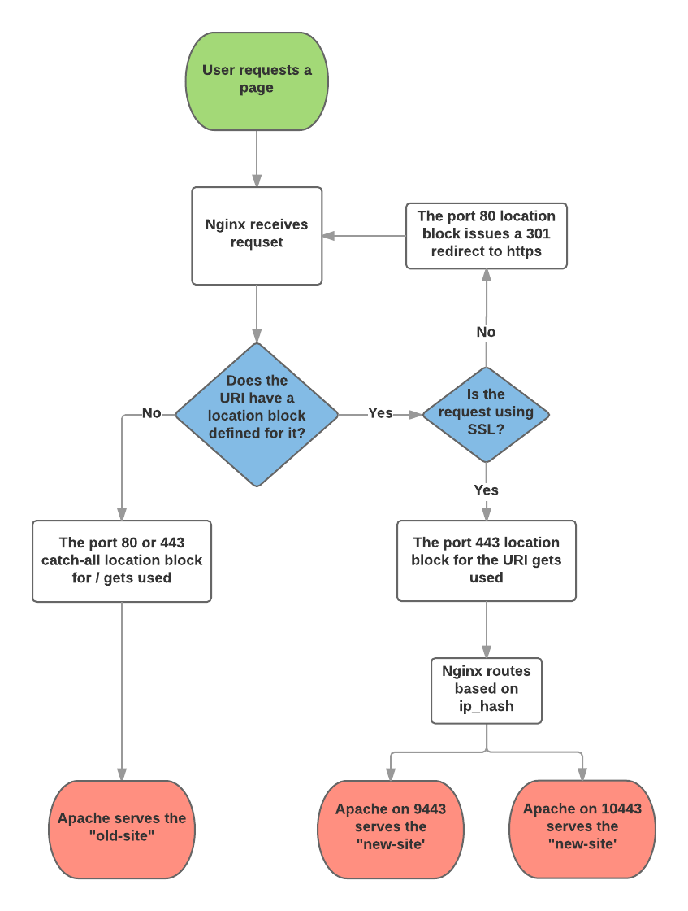

# nginx-uri-proxy
Nginx-to-Apache proxy that picks the backend server based on the requested URI

## Why do this?

The intent of this setup is to demonstrate a method for migrating a website to
a new server, or a new content management system, one URI at a time. By taking
this approach you do not have to have your entire site ready for transition at
the same time.

The flow of a request for a web page when using this setup looks like this:

## What's in this repo?

This example setup uses location blocks in Nginx to determine which "upstream"
server to route traffic to. Three upstreams have been setup:

1. "Old" Apache site with http on port 8081
2. "Old" Apache site with https on port 8444
2. "New" Apache site with https on 9444 and 10444

The new site uses https for all requests so the port 80 server has location
blocks that issue 301 redirects to the https version of any migrated URI. It
also introduces load balancing on the backend. The load balancing utilizes
the `ip_hash` option so that clients are always routed to the same backend
server. This is done since sessions are not synchronized between the Apache
instances.

## How to run this demo?

This demo utilizes [Vagrant](https://www.vagrantup.com/).
It sets up a CentOS 7 virtual machine and exposes it to your local network. To
use the demo you should follow these steps:

1. Clone the project, cd into its directory, and run `vagrant up`. If you see
  any failures during the setup all you need to do is run `vagrant reload
  --provision` and it should finish setting things up.
2. Once the system is up run `vagrant ssh` to connect to the VM.
3. Run `ifconfig` and look for the IP that looks similar to the one your computer
  is using.
4. Open a web browser and go to the IP you just found.
5. Click around on the links to see what happens.
